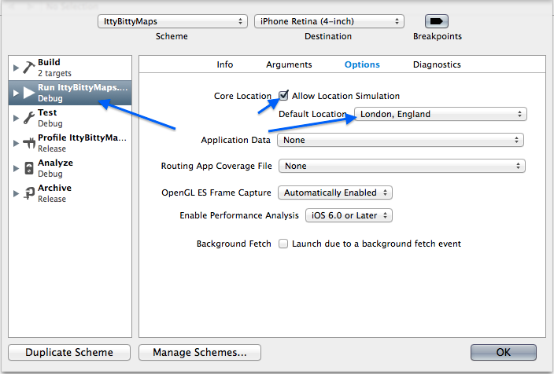
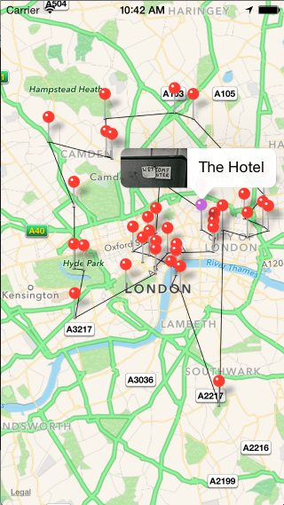
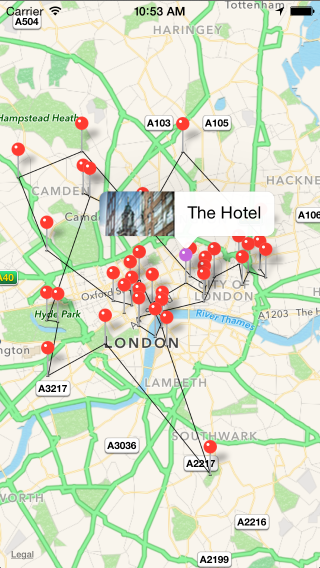

#IttyBittyMaps
This is a simple application that, at startup, fetches 100 images from Flickr, and tries two draw a good route between them. 

#How it works
The first thing it does is to draw out the map, and once it gets the users location, it starts fetching photos from the Flickr API. When this is done it tries to parse these photos to create "Photo locations". Sometimes one location can include multiple photos, just so the map doesn't get too cluttered. 
The locations are the added to the map, whilst a "Tour planner" is calculating the best path using a Genetic Algoritm. This is done by setting up a pool of random variations of the tour, which we then "evolve" by doing crossovers between shorter tours (with a spice of mutation). The tour is then drawn on to the map and the "Hotel" is selected (the user wants to know where to start). 

#Usage
Everything should be included in the repo. You should be able to build it as is. 

Just make sure to select IttyBittyMaps when bulding. Also, you can simulate your location like this: 

#Disclaimer
The Genetic algoritm is trying to find the shortest route, which might not always look the best. I have been able to cut the distance in half or more. I also need to consider the resticted hardware on the iPhone. 

I am currently using FlickrKit to fetch the images which is a bit over the top. If I would have redone this I would have put some more effort into creating my own manager for handling the specific API calls that I need. For this task, I thought it was ok to use a library since it made the code much more readable and easy to understand. I am, however, usually not a fan of adding bulky stuff that I dont understand just to perform a small number of isolated tasks. 

#Genetic Algorithm Specs

* Population size: 100
* Evolution cycles: 100
* Mating pool size: 5
* Mutation rate: 2%

#Example

#What's next?
I would like to make it possible for the user to click on a location and have the possibility to display all the batched images in a new view. 
