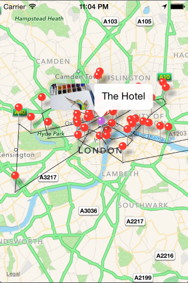

#IttyBittyMaps
This is a simple application that, at startup, fetches 100 images from Flickr, and tries two draw a good route between them. 

#Usage
Everything should be included in the repo. You should be able to build it as is. 

#Example

#Disclaimer
The Genetic algoritm is trying to find the shortest route, which might not always look the best. I have been able to cut the distance in half or more. I also need to consider the resticted hardware on the iPhone. 

#Genetic Algorithm Specs

Population size: 100
Evolution cycles: 100
Mating pool size: 20
Mutation rate: 2%

